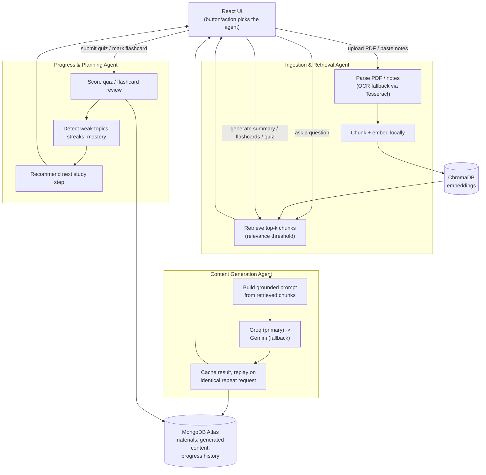

# Smart Study Generator Agent

A solo B.E. CSE project that turns a student's own PDFs (including scanned/image-only ones, via OCR) and pasted notes into grounded answers, summaries, flashcards, quizzes, and a performance-driven study plan.

## What is implemented

| Agent | UI action | Result |
| --- | --- | --- |
| Ingestion & Retrieval | Upload PDF, index notes, ask material | Text is extracted (falling back to Tesseract OCR for scanned pages), chunked, embedded locally in ChromaDB, then retrieved for grounded Q&A with a relevance threshold — weak matches return "not found" instead of a guess. |
| Content Generation | Generate summary, flashcards, or quiz | Retrieved course material is passed to Groq, with Gemini as the fallback provider. Results are persisted in MongoDB and replayed instead of re-generated for an identical request, so revisiting a set (or a live demo) doesn't burn API quota. |
| Progress & Planning | Submit a generated quiz, mark a flashcard known, open Dashboard/Progress | Scoring, weak-topic detection, flashcard mastery, study streak, and next-study recommendations are computed deterministically and stored in MongoDB Atlas. |

The React UI chooses the operation from its button/action; it does not spend an LLM request on routing.

## Workflow

Three agents cooperate around two stores (ChromaDB for embeddings, MongoDB for structured records). Routing between agents is deterministic — the UI action picked by the student decides which agent runs, not an LLM supervisor call.



Typical request paths:
1. **Ask a question** — Ingestion agent retrieves the closest chunks from ChromaDB and answers only if similarity clears the threshold, otherwise it reports "not found" instead of guessing.
2. **Generate a study aid** — Content Generation agent grounds the LLM prompt in retrieved chunks, tries Groq first and falls back to Gemini, then caches the result in MongoDB so an identical request later replays it instead of re-calling the LLM.
3. **Track progress** — Progress & Planning agent scores the submitted quiz/flashcard, updates weak-topic and streak state in MongoDB, and recomputes the study recommendation shown on the dashboard.

## Run locally

### 0. OCR dependency (one-time)

Scanned/image-only PDF pages are read with Tesseract OCR. Install it once:

```powershell
winget install --id UB-Mannheim.TesseractOCR -e
```

If it installs somewhere other than `C:\Program Files\Tesseract-OCR\tesseract.exe`, set `TESSERACT_CMD` in `backend/.env` to the actual path.

### 1. Backend

Install Python 3.11 or newer if it is not available, then from the repository root:

```powershell
cd backend
py -3 -m venv .venv
.\.venv\Scripts\Activate.ps1
pip install -r requirements.txt
Copy-Item .env.example .env
uvicorn app.main:app --reload
```

Set `GROQ_API_KEY` and/or `GEMINI_API_KEY` in `backend/.env`. The default Groq model is `openai/gpt-oss-20b`, replacing the retired Llama 3.3 model; override it with `GROQ_MODEL` only when that model is enabled for your Groq project. Add a valid `MONGODB_URI` for persistent progress, materials, and generated content — otherwise these fall back to in-memory storage for local development. The API documentation is available at `http://127.0.0.1:8000/docs`.

### 2. Frontend

In a second terminal:

```powershell
cd frontend
Copy-Item .env.example .env
npm install
npm run dev
```

Open the URL shown by Vite (normally `http://127.0.0.1:5173`). `VITE_API_BASE_URL` defaults to `http://127.0.0.1:8000`.

## Demo walkthrough

1. Start both services and check `/health` returns `ok`.
2. Go to **Study Material**, set a subject/course, and upload a PDF (scanned or text-based) or paste lecture notes.
3. Ask a question to demonstrate grounded RAG with page citations, an excerpt, and a relevance score.
4. Go to **Flashcards & Quizzes**, enter a topic (or leave it blank to use the whole subject) and generate a quiz or flashcard set. Regenerating with the same inputs replays the saved result instead of calling the LLM again.
5. Flip a flashcard and mark it "I know this" / "Still learning", or answer all quiz questions and save the result.
6. Open **Dashboard** / **Progress** to see live aggregate score, flashcards mastered, study streak, weak topics, and recommendations — all computed from real MongoDB-backed history, not placeholders.
7. Back on **Study Material**, delete a document to see its chunks removed from retrieval immediately.

## API overview

| Method | Endpoint | Purpose |
| --- | --- | --- |
| `POST` | `/api/materials/pdf` | Index a PDF (OCR fallback for scanned/image-only pages). |
| `POST` | `/api/materials/notes` | Index pasted notes. |
| `GET` | `/api/materials` | List indexed documents, optionally filtered by `collection`. |
| `GET` | `/api/materials/collections` | List distinct subject/course collections. |
| `DELETE` | `/api/materials/{document_id}` | Remove a document and its embedded chunks. |
| `POST` | `/api/study/ask` | Answer a question using retrieved material, with sources and relevance scores. |
| `POST` | `/api/study/generate` | Generate (or replay a cached) summary, flashcards, or quiz. |
| `GET` | `/api/study/generated` | List previously generated study aids. |
| `POST` | `/api/progress/attempts` | Score and persist a quiz attempt. |
| `POST` | `/api/progress/flashcards` | Record a flashcard as known / still learning. |
| `GET` | `/api/progress/{student_id}/plan` | Return weak topics and study recommendations. |
| `GET` | `/api/progress/{student_id}/summary` | Return live dashboard metrics (score, streak, mastery, quizzes completed). |

## Scope

Supported input is PDFs (text-based or scanned, via OCR) and typed/pasted notes. Voice-note input and non-PDF image uploads are intentionally future work.
